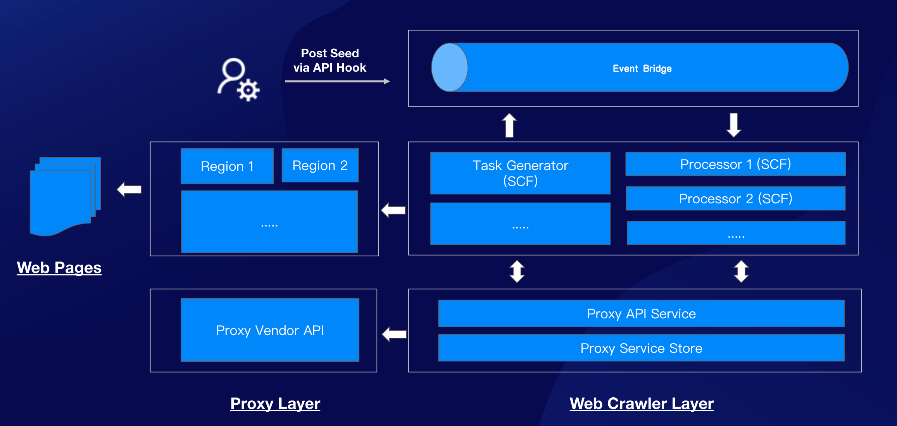
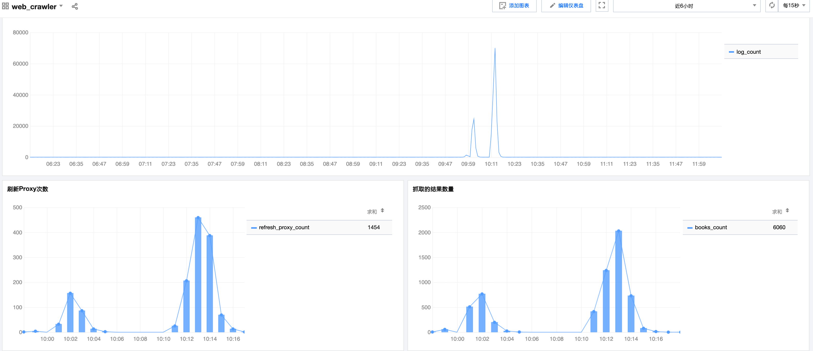

A demo to implement web crawlers based on the concept of FaaS, it takes a event-driven approach by leverage the Event Bridge and SCF together.

**!!Only for demo!! Please follow the rules of Robots.txt**


### Architecture



### Test Result

with default SCF quota:



### Website:
 - Sample Index Page: https://www.thriftbooks.com/browse/#b.s=bestsellers-desc&b.p=1&b.pp=50&b.nr
 - Sample Detail Page: https://www.thriftbooks.com/w/reminders-of-him_colleen-hoover/28978064#edition=60120699&idiq=46800918


### Todo
- [x] Loading the url of proxy API from environments
- [x] Add the architecture diagram
- [ ] Deploy to SCF with `Serverless Framework`
- [ ] Routing the image download task to another SCF function

 
### Features:

- Auto scaling as the requests increases
- High performance with Event-Driven 
- Low maintenance cost
- Auto switch the proxy info
- Retry and timeout mechanism


### Compoments:

- web_crawler: Python scripts using `BeautifulSoup4`
    - access the link and parse html documents to desired results
    - loading proxy info from remote proxy server
    - Deploy to `SCF` with the origin Python runtime `3.7.2`
- proxy_server: A lightweight web server using Sanic framework
    - Cosidering the rate limit and the quality of proxies, it required a web server to de-couple the complexity from `web_crawler`
    - Only for demo purpose, the proxy info load from remote will cached into memory directly, suggest to use a shared store eg. Redis to share the data across SCF instances
    - Deploy as Container image to `SCF` due to the compatibility issue with `httptools`, which requires a dynamic so

### Product  Dependencies

- SCF: Runtime for `web_crawler` and `proxy_server`
- Event Bridge: SCF Triggers, configured as a `web hook`
- API Gateway: Event Bridge Connectors, consider using the instance with high performance

## Trigger the crawler on Remote

Sample URL: https://service-yyyyyy-xxxx.gz.apigw.tencentcs.com/release/

Post the message to Event Bridge:

```json
 {
    "ResourceLink": "https://www.thriftbooks.com/browse/#b.s=bestsellers-desc&b.p=1&b.pp=50&b.nr",
    "TaskType": "VisitIndexPage",
    "Data": {
        "CurrentPageIndex": 1,
        "MaxPageIndex": 2
    }
}
```

## Local Development

Run on local:

```bash
pyenv exec python3 local_web_crawler.py
```

Run tests:

```bash
./run_tests.sh
```

Debug:

```bash
./run_debug.sh
```

Building Container Images for Proxy Server:

```bash
docker build . -t xxxxx.tencentcloudcr.com/yyyyy/web_crawler_proxy:v0.1
```

Run proxy server on local:

```bash
export PROXY_VENDOR_API="http://proxy.vendor.com/getip?xxxxx=yyyyy"
docker run -e PROXY_VENDOR_API=$PROXY_VENDOR_API --rm -it -p 9000:9000 xxxx.tencentcloudcr.com/yyyyyy/web_crawler_proxy:v0.1
```

## Environment Variables

scf_web_crawler:

```bash
CHECK_PUBLIC_IP=False
EB_WEBHOOK=https://service-xxxx-yyy.gz.apigw.tencentcs.com/release/
ENV=prod
LOG_LEVEL=DEBUG
PROXY_ENABLED=True
PROXY_SERVER_BASE_URL=https://service-xxxxx-yyyyy.gz.apigw.tencentcs.com/release
```

Proxy Server:

```bash
PROXY_VENDOR_API=http://proxy.vendor.com/getip?xxxxx=yyyyy
```
## Vendor Dependencies

```bash
pyenv exec pip3 install -r requirements.txt -t vendor/
```